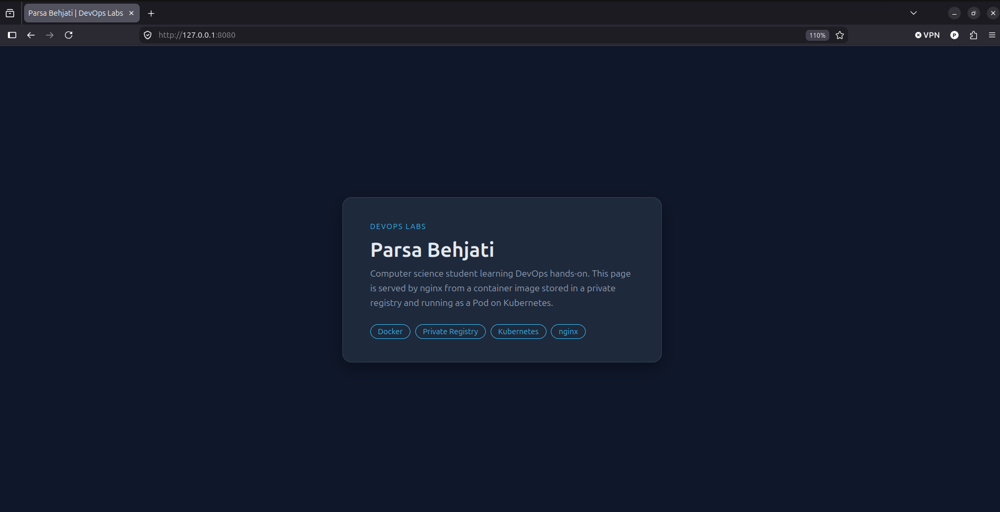

# Lab: Docker image and private registry

A small static page served by nginx, packaged as a container image and stored in a private (local) Docker registry.

## Build the image

```bash
docker build -t hello_kube:1.1.0 .
```

## Run a local registry

```bash
docker run -d -p 5000:5000 --restart=always \
  --name registry -v registry-data:/var/lib/registry registry:latest
```

The named volume keeps images when the container is removed.

## Push the image

```bash
docker tag hello_kube:1.1.0 localhost:5000/hello_kube:1.1.0
docker push localhost:5000/hello_kube:1.1.0
curl http://localhost:5000/v2/hello_kube/tags/list
```

Expected:

```
{"name":"hello_kube","tags":["1.1.0"]}
```

## Result


